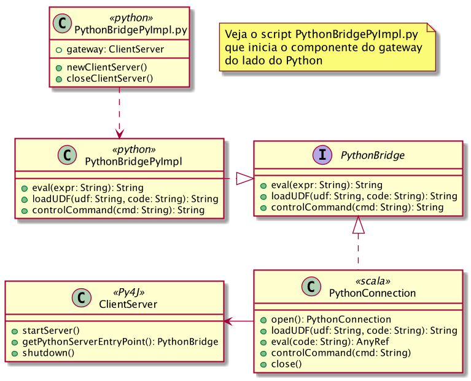

# HPC

[Get the entire eBook series about Spark from Databricks](http://go.databricks.com/7-steps-for-a-developer-to-learn-apache-spark?utm_campaign=Databricks%20newsletter&utm_source=hs_email&utm_medium=email&utm_content=44124120&_hsenc=p2ANqtz-9chmFLBrc99ww739qGGfOM4oaeoyVzR_ii9Qt9v2kEXVT4nSQs_LMcQIYPE_Po5xqQbwfBxKtiHqkrcRbWiJL8Tey4J4RPSj3mHeWZXxkiiZ3NXGI&_hsmi=44124120)

